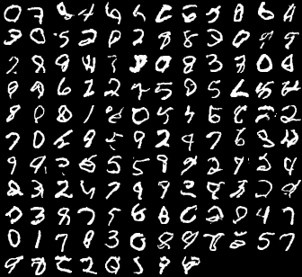

PixelCNN is a model under Autoregressive models used to learn the data distributions for generative purposes.
The code has been adopted from https://github.com/jzbontar/pixelcnn-pytorch/ . I cleaned and organized the code.

Some of the advantages of Auto-regressive models over GANs are:
1. Provides a way to calculate likelihood : These models have the advantage of returning explicit probability densities (unlike GANs), making it straightforward to apply in domains such as compression and probabilistic planning and exploration
2. The training is more stable than GANs : Training a GAN requires finding the Nash equilibrium. Since, there is no algorithm present which does this, training a GAN is unstable as compared to PixelRNN or PixelCNN.
3. It works for both discrete and continuous data : It’s hard to learn to generate discrete data for GAN, like text.

The files contained: 

1- main.py which contains the code for the model and training 

2- sample.py which you can use to synthesize samples (you can load the pretrained model last.pt)

Here is an example of the images generated by Pixel CNN after being trained for 30 epochs on MNIST dataset:

